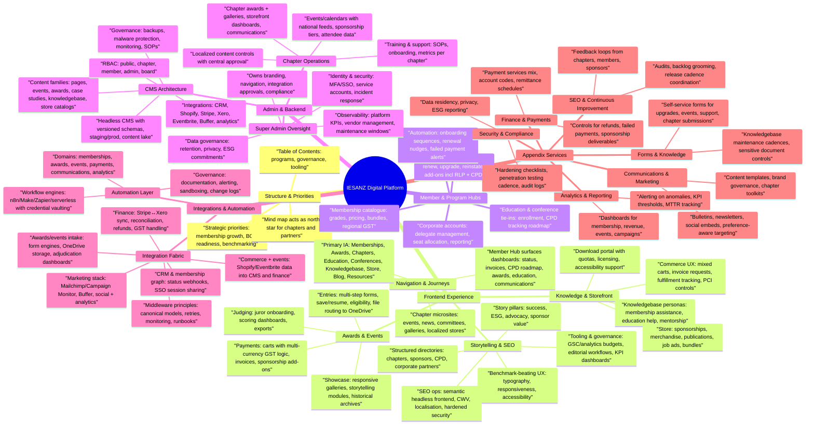

# Platform Mind Map

## Sitemap & Operating Model Overview

```mermaid
mindmap
  root((IESANZ Digital Platform))
    Structure & Priorities
      "Table of Contents: programs, governance, tooling"
      "Strategic priorities: membership growth, BOT readiness, benchmarking"
      "Mind map acts as north star for chapters and partners"
    Frontend Experience
      Navigation & Journeys
        "Primary IA: Memberships, Awards, Chapters, Education, Conferences, Knowledgebase, Store, Blog, Resources"
        "Member Hub surfaces dashboards: status, invoices, CPD roadmap, awards, education, communications"
        "Chapter microsites: events, news, committees, galleries, localized stores"
      Storytelling & SEO
        "Benchmark-beating UX: typography, responsiveness, accessibility"
        "Story pillars: success, ESG, advocacy, sponsor value"
        "Structured directories: chapters, sponsors, CPD, corporate partners"
        "SEO ops: semantic headless frontend, CWV, localisation, hardened security"
        "Tooling & governance: GSC/analytics budgets, editorial workflows, KPI dashboards"
      Awards & Events
        "Entries: multi-step forms, save/resume, eligibility, file routing to OneDrive"
        "Payments: carts with multi-currency GST logic, invoices, sponsorship add-ons"
        "Judging: juror onboarding, scoring dashboards, exports"
        "Showcase: responsive galleries, storytelling modules, historical archives"
      Knowledge & Storefront
        "Knowledgebase personas: membership assistance, education help, mentorship"
        "Download portal with quotas, licensing, accessibility support"
        "Store: sponsorships, merchandise, publications, job ads, bundles"
        "Commerce UX: mixed carts, invoice requests, fulfillment tracking, PCI controls"
    Member & Program Hubs
      "Membership catalogue: grades, pricing, bundles, regional GST"
      "Lifecycle flows: join, renew, upgrade, reinstate, add-ons incl RLP + CPD"
      "Corporate accounts: delegate management, seat allocation, reporting"
      "Automation: onboarding sequences, renewal nudges, failed payment alerts"
      "Education & conference tie-ins: enrollment, CPD tracking roadmap"
    Admin & Backend
      CMS Architecture
        "Headless CMS with versioned schemas, staging/prod, content lake"
        "Content families: pages, events, awards, case studies, knowledgebase, store catalogs"
        "RBAC: public, chapter, member, admin, board"
        "Integrations: CRM, Shopify, Stripe, Xero, Eventbrite, Buffer, analytics"
        "Governance: backups, malware protection, monitoring, SOPs"
      Chapter Operations
        "Localized content controls with central approval"
        "Events/calendars with national feeds, sponsorship tiers, attendee data"
        "Chapter awards + galleries, storefront dashboards, communications"
        "Training & support: SOPs, onboarding, metrics per chapter"
      Super Admin Oversight
        "Owns branding, navigation, integration approvals, compliance"
        "Identity & security: MFA/SSO, service accounts, incident response"
        "Data governance: retention, privacy, ESG commitments"
        "Observability: platform KPIs, vendor management, maintenance windows"
    Integrations & Automation
      Automation Layer
        "Workflow engines: n8n/Make/Zapier/serverless with credential vaulting"
        "Domains: memberships, awards, events, payments, communications, analytics"
        "Governance: documentation, alerting, sandboxing, change logs"
      Integration Fabric
        "Finance: Stripe↔Xero sync, reconciliation, refunds, GST handling"
        "CRM & membership graph: status webhooks, SSO session sharing"
        "Awards/events intake: form engines, OneDrive storage, adjudication dashboards"
        "Commerce + events: Shopify/Eventbrite data into CMS and finance"
        "Marketing stack: Mailchimp/Campaign Monitor, Buffer, social + analytics"
        "Middleware principles: canonical models, retries, monitoring, runbooks"
    Appendix Services
      Analytics & Reporting
        "Dashboards for membership, revenue, events, campaigns"
        "Alerting on anomalies, KPI thresholds, MTTR tracking"
      Communications & Marketing
        "Bulletins, newsletters, social embeds, preference-aware targeting"
        "Content templates, brand governance, chapter toolkits"
      Finance & Payments
        "Payment services mix, account codes, remittance schedules"
        "Controls for refunds, failed payments, sponsorship deliverables"
      Security & Compliance
        "Hardening checklists, penetration testing cadence, audit logs"
        "Data residency, privacy, ESG reporting"
      Forms & Knowledge
        "Self-service forms for upgrades, events, support, chapter submissions"
        "Knowledgebase maintenance cadences, sensitive document controls"
      SEO & Continuous Improvement
        "Audits, backlog grooming, release cadence coordination"
        "Feedback loops from chapters, members, sponsors"
```
